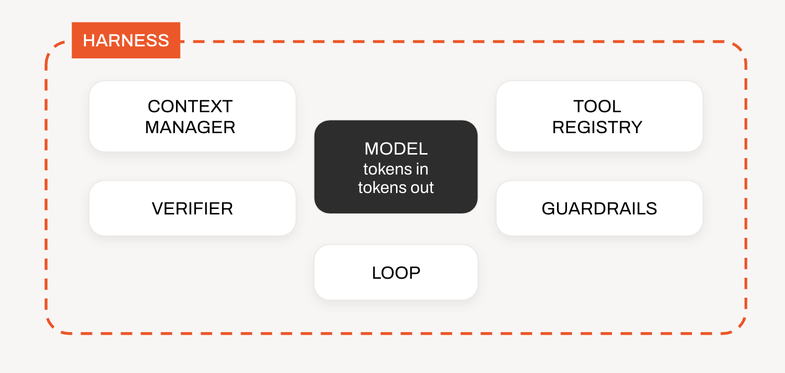

# Let's Build an Agent Harness!

Let's build an agent harness for [SF Tech Week Agent Day 2025](https://luma.com/7wn8tsf7?tk=bLL6Dr)!

In this one-hour, hands-on harness engineering workshop, you will wrap a small local model (Qwen3.5 2B) in the five essential parts of an agent harness and watch the same model go from having no investigative ability to being able to find a bad payment in an Apache Kafka topic and verifying it.

## Workshop setup

Do this at home or before the workshop begins. The images and the model come to about 9 GB, which is a lot for venue Wi-Fi to handle.

You need:

- 16 GB of RAM and about 15 GB of free disk
- `make`, `git` and a code editor
- Docker Desktop or Docker Engine with Compose 2.20 or later. Give Docker at least 8 GB of memory (6 GB if Ollama runs natively)
- macOS only: the [Ollama app](https://ollama.com/download)

### 1. Configure

```
cp .env.example .env
```

Open `.env`, read the [Lenses EULA](https://lenses.io/legals/eula) and set `ACCEPT_EULA=true`.

The Docker Compose stack is based on [Lenses Community Edition](https://lenses.io/community-edition), which provides a demo environment and tools for building a harness with an event log based on Apache Kafka.

On macOS, Docker can't use the Apple GPU, so run Ollama natively instead of in a container:

```
ollama pull qwen3.5:2b
```

Then set these two lines in `.env`:

```
COMPOSE_PROFILES=
OLLAMA_URL=http://host.docker.internal:11434
```

On Linux and Windows, leave them as they are and Ollama runs in Compose.

### 2. Download everything

```
docker compose pull --ignore-buildable
docker compose build
```

### 3. Start, log in and check

```
make up
make login
make doctor
```

`make login` opens http://localhost:8080/login in your browser. Sign into Lenses as `admin` / `admin`, check that the harness asks for the `read` scope and nothing else and click **Authorise**. The harness keeps the tokens on a Docker volume and refreshes them on its own, so you log in once (again only after `make down`).

`make doctor` should print:

```
✓ Kafka               demo-kafka:19092
✓ Topics              payments has 5 records, agent.session has 0 events
✓ Lenses login        scope read, token valid for 59 more minutes
✓ Lenses MCP          24 tools at http://lenses-mcp:8000/mcp
✓ Lenses environment  demo connected
✓ Ollama              qwen3.5:2b at http://host.docker.internal:11434
✓ Harness API         http://localhost:8080/v1
✓ OpenCode            http://localhost:4096

All good. Open http://localhost:4096
```

`make doctor` runs inside the harness container, so it prints each address as the harness sees it. `demo-kafka` and `lenses-mcp` are names on the Compose network and `host.docker.internal` is your Mac. Lenses MCP has no port on your machine, because only the harness talks to it.

If the Lenses environment isn't connected yet, wait a minute and run it again.

### 4. Open the OpenCode chat

1. Open http://localhost:4096
2. Click **Add project** and choose `/workspace` (once only)
3. Start a new session and type `/investigate`

The harness has no tools yet, so the model can't look at Kafka. Asked in plain text, `qwen3.5:2b` says so. But until part 2 puts tools on the menu, the harness makes `/investigate` answer as JSON with a non-empty `order_id` and `what_is_wrong`, which is how a lot of real products call a model. Ollama's `format` limits decoding to that schema, so "I can't see the cluster" is no longer something the model can write and it makes up an ID. You'll get something like `{"order_id": "12345", "what_is_wrong": "The amount field contains non-numeric data."}`. That's stage 0 and it means everything works.

Run it a few times, or compare with the person next to you. The ID changes almost every run and none of them are on `payments`. Nothing checks the answer yet, so the harness reports it as the model's word.

Set `STAGE0_JSON = False` in `settings.py` to let the model answer in plain text and compare.

## Agent = model + harness

An agent is a model plus a harness. When you own the harness, you can swap the model and it will still be fit for production.

A minimal harness consists of 5 parts: Context manager, Tool registry, Guardrails, Loop and Verifier.



| #   | Part            | File            | What you'll see                                        |
| --- | --------------- | --------------- | ------------------------------------------------------ |
| 0   | Nothing yet     | `stage0.py`     | A model invents an `order_id`. Zero tool calls         |
| 1   | Context manager | `context.py`    | Memory rebuilt from Kafka, surviving a harness restart |
| 2   | Tool registry   | `tools.py`      | One step finds the topic and can't read what it found  |
| 3   | Guardrails      | `guardrails.py` | An `INSERT` is blocked at the gate, logged on Kafka    |
| 4   | Loop            | `loop.py`       | `execute_sql`, then an answer                          |
| 5   | Verifier        | `verifier.py`   | A verified answer, or a failure sent back to the loop  |

Each part is one `TODO` of one to eight lines in `harness/src/harness/`.

## How it fits together

```
Browser ──> OpenCode web UI :4096        chat window only: no tools, no model access
               │  OpenAI-compatible request, header X-Session-Id
               v
            Harness (Python, FastAPI) :8080   ← you build this
               │         │            │
               │         │            └── Ollama /api/chat   qwen3.5:2b
               │         └── Lenses MCP :8000 ──> Kafka topic "payments"   (the environment)
               │               (OAuth: your login, read scope only)
               └── Kafka topic "agent.session"   (the log: every event, keyed by session)

Lenses HQ :9991   watch both topics side by side
```

OpenCode sends its whole transcript and its own system prompt on every request. The harness keeps only your newest message and the session ID. Everything the model sees is rebuilt from `agent.session` before every model call, so the harness can restart at any moment (it restarts every time you save a file) and carry on where it left off.

## During the workshop

Edit the files in `harness/src/harness/` on your machine. The harness reloads as soon as you save. Start a **new OpenCode session** for every `/investigate` run.

Fallen behind? The `make catchup STEP=n` command copies the finished code solution for steps 1 to `n` in place and the harness reloads in about a second.

Watch the trace in the thinking block in OpenCode, or in a terminal with `make logs`. Check your work at any point with `make test STEP=n`.

### 1. Context manager: `context.py`

> The model only sees the window you assemble.

`project()` turns the session log into the window for one model call. The starter version has goldfish memory: the system prompt and your newest message, nothing else. Replace it with a fold over every event that is `on_surface()` and let `fit()` apply the token budget.

Try it:

1. In a new session, say `Hi, I'm Tun`, then `I look after the payments topic`, then ask `From this conversation, what is my name and which topic do I look after?`
2. Run `docker compose restart harness` and ask again. It still remembers.

In Lenses HQ, open the `agent.session` topic and watch the events arrive.

### 2. Tool registry: `tools.py`

> The model can only act through tools you register.

The starter menu is empty. Put three tools on it: `READ_FILE` (a local tool the harness owns) and `lenses_tool("list_topics")` and `lenses_tool("execute_sql")` from Lenses MCP. `lenses.py` shows how the harness reshapes them for a small model: it hides the `environment` argument, gives every tool a required parameter and turns big JSON into a few lines.

Try it: run `/investigate`. There is still no loop, so the harness runs exactly one step and shows you raw results.

Optional: set `REGISTER_ALL_MCP_TOOLS = True` in `settings.py` to send every Lenses tool your login can see with every call. That's 24 with the `read` scope (the server has about 45). Watch the prompt tokens climb in the trace (about 3,300 instead of 600), then set it back.

### 3. Guardrails: `guardrails.py`

> Guardrails decide whether this call may run.

`execute_sql` is on the menu and Lenses SQL can `INSERT`. Allow a single `SELECT` and block everything else. The session-log rule above the `TODO` shows the shape.

Try it: type `/insert`. The trace shows `✗ GUARDRAIL execute_sql allows a single SELECT only`. Ask politely instead ("insert a payment for me") and the model usually refuses on its own, because `AGENTS.md` tells it not to change data. The gate doesn't rely on that.

The harness logged into Lenses with the `read` scope only, so the platform refuses writes too. The MCP server hides every tool that needs `write` and Lenses turns down an `INSERT` sent through `execute_sql` ("The configured security policies prevent you from carrying out this action", in `docker compose logs lenses-mcp`). The model never sees that message: `execute_sql` returns zero rows and nothing is written.

### 4. Loop: `loop.py`

> A step in the loop is one model request plus its tools.

In this harness, a turn is one user message and the answer to it. A step is one round trip to the model inside that turn. One turn is made of one or more steps.

`run_turn()` runs one step and stops. Make it repeat `step()` until the model answers in text and check `check_caps()` before every step.

Try it: run `/investigate` and watch `execute_sql` (sometimes after `list_topics`) and then an answer. Set `MAX_STEPS = 1` to see a cap end the turn.

In Lenses HQ, watch the `agent.session` topic while the agent investigates:

- `value.step` goes up by one for every model request in the turn (1, 2, 3, etc) and starts again at 1 on the next turn, when `value.turn` goes up. Every event from one step has the same `step`: the `assistant/tool_call`, then its `tool/result` (or `guardrail/block`) events.
- Each turn ends with one `loop/exit` event (`value.type`), and `value.data.reason` says why the loop stopped:

  | `reason` | When you see it |
  | --- | --- |
  | `stop on text` | The model answered in text instead of calling a tool. This is the normal end. |
  | `max steps (6) reached` | `check_caps()` stopped the turn at `MAX_STEPS`. Try it with `MAX_STEPS = 1`. |
  | `run token budget (20000) reached` | `check_caps()` stopped the turn at `RUN_TOKEN_BUDGET`. |
  | `error: ...` | The model, Lenses or the login failed, and the harness stopped the turn. |
  | `one step only` | The starter `run_turn()` from before this step: no loop yet. |

Now that there are tool results, try the budget: ask a follow-up in the same session (`Which merchant was that payment at?`), set `WINDOW_BUDGET = 600` in `settings.py` and ask again. The window shrinks in the trace. Older steps drop out and older tool results become stubs that point at their Kafka offset, while the goal stays.

### 5. Verifier: `verifier.py`

> The verifier inspects the environment, not the model's claim.

`verify()` gets every record on `payments`, read by the harness's own consumer, plus the topic's end offset before and after the turn. Find the invalid payment in the data, check it's the last payment the answer names and check nothing was written. Small models often list every record before they conclude, so the conclusion is what counts: "None of them look invalid", followed by all five records, must fail. Don't put the answer in the failure message: it goes back to the model.

Try it: run `/investigate`. You get `✓ Verified` with the reason, or `✗ Verification failed` and a second attempt.

In Lenses SQL Studio, run the human version of the check:

```sql
SELECT * FROM payments WHERE amount < 0
```

Then replay a whole session (copy the session ID from `make logs`):

```sql
SELECT _meta.offset AS offset, type, step FROM `agent.session` WHERE session_id = '<session id>' LIMIT 50
```

## Commands

| Command | What it does |
| --- | --- |
| `make up` | Start the whole stack |
| `make login` | Log the harness into Lenses (once and again after `make down`) |
| `make doctor` | Check every service from inside the harness |
| `make test STEP=3` | Run the tests for steps 1 to 3 |
| `make catchup STEP=3` | Copy the solutions for steps 1 to 3 into `harness/src` |
| `make logs` | Follow the harness trace |
| `make events` | Print the raw session log from Kafka |
| `make reset` | Delete both topics and seed them again |
| `make down` | Stop everything and delete its data |

## How the harness works

### Why the harness keeps an event log

The model is stateless: it remembers nothing between calls. A harness that keeps the conversation in Python memory loses it on every crash, deploy or reload, and nobody can say afterwards what the model was shown when it made a decision. So this harness keeps no state of its own. Everything that happens in a session goes onto an append-only Kafka topic, `agent.session`, before the harness acts on it, and the log is the only memory there is.

That gives you four things a production agent needs:

- **Durability.** The harness can restart at any moment and carry on from the log. In this workshop it restarts every time you save a file.
- **Replay.** Any window the model saw can be rebuilt exactly, because `project()` is a pure fold over the log. When an agent gives a bad answer, you can see what it was shown and why.
- **Audit.** Every tool call, every guardrail block, every verifier result and why each turn ended is on record, with a timestamp and an offset. Blocked actions are logged just like allowed ones.
- **Observability.** Other consumers can read the same topic without touching the harness. Lenses HQ shows it live, SQL Studio queries it and the same stream could feed alerts, evals or a dashboard.

The session log follows DeepSeek Harness's rule: anything that reaches the model must be rebuildable from the log.

### What goes into the context

The Context Manager (`context.py`) decides everything the model sees. It ignores what OpenCode sends, apart from your newest message and the session ID. OpenCode's own system prompt and transcript are thrown away, so the client can't change what the model is told.

Each window is built from these parts, in this order:

1. **The system prompt.** `SYSTEM_PROMPT` in `context.py` is short and fixed: it tells the model it investigates a Kafka cluster, can act only through the tools the harness registered and should answer briefly.
2. **`AGENTS.md`.** `harness/files/AGENTS.md` holds the task instructions: which tools to use for what, to read every record before deciding and never to change data. `assemble_system_prompt()` appends it to the system prompt under a `# AGENTS.md` heading. Edit this file to change how the agent works without touching code. The model can also read it again with the `read_file` tool.
3. **The conversation.** Every `on_surface()` event from the log, rendered as a chat message: your messages, the model's tool calls and answers, tool results, guardrail blocks and failed verifier checks.
4. **The tool schemas.** These are sent alongside the messages, not inside them, but they count towards the same token budget (`WINDOW_BUDGET`).

The system prompt and `AGENTS.md` are assembled once, when the session starts, and written to the log as the `system/prompt` event. Every window after that uses those exact bytes, so a changed `AGENTS.md` applies to new sessions only and a replay always shows the prompt the model really had.

### The session log

Every event is one JSON record on `agent.session`, keyed by the OpenCode session ID. The topic has one partition, so offset order is event order and `retention.ms=-1`, because Kafka deletes records after seven days by default.

| Event | Written by | In the window as |
| --- | --- | --- |
| `system/prompt` | the harness, once per session | system message (system prompt plus `AGENTS.md`) |
| `user/message` | the harness, once per turn | user message |
| `assistant/tool_call` | the loop, before any tool runs | assistant message with tool calls |
| `tool/result` | the loop | tool message, stubbed once it is old |
| `guardrail/block` | the loop, when the gate says no | tool message: `BLOCKED by a guardrail: ...` |
| `assistant/message` | the loop, when the model answers | assistant message |
| `verifier/result` | the verifier | user message, only when it failed |
| `loop/exit` | the loop | never: it's for humans |

At stage 0, the forced JSON answer is an ordinary `assistant/message` with `answer_format: "stage0"`, so you can find those answers on the log.

Before every model call, `read_session()` reads the session back from Kafka (assign, read to the end of the partition, no consumer group) and `project()` folds it into a window. Writes wait for Kafka's acknowledgement before the harness moves on, so the next window always contains the result just written. Anything the model saw can be rebuilt from the log: each assistant event records `context_upto`, the last offset folded into its window.

### The window policy

1. The system prompt and `AGENTS.md` come first, as the same bytes every time, so Ollama can reuse its prompt cache.
2. The first user message (the goal) always stays.
3. The newest steps stay whole and a tool call stays next to its results.
4. Tool results older than two steps become stubs that point at their Kafka offset.
5. Tokens are estimated at three characters each, tool schemas included. The harness sends `truncate: false` to Ollama, so an oversized window fails loudly instead of silently losing the goal.

### How the harness logs into Lenses

The Lenses MCP server runs in OAuth mode, as Community Edition ships it. It holds no credentials of its own: it checks each request's token with Lenses HQ and passes it on, so every tool call runs as the person who logged in, within the scopes they granted.

1. `make login` opens `http://localhost:8080/login`. The harness registers itself with Lenses HQ's authorisation server (dynamic client registration), creates a PKCE challenge and sends your browser to HQ.
2. You sign in and Lenses HQ asks you to grant the `read` scope. The harness never asks for `write` or `delete`.
3. Lenses HQ sends your browser back to `http://localhost:8080/oauth/callback` with a code. The harness swaps it for an access token and a refresh token (`oauth.py`) and keeps them on the `harness-state` volume, outside the source tree, so they survive every reload.
4. Every MCP request carries the access token. The harness refreshes it a minute before it expires (Lenses HQ issues one-hour tokens).

Lenses HQ has two addresses: your browser uses `localhost:9991` (the issuer) and the harness uses `lenses-hq:9991` on the Compose network. `oauth.py` sends your browser to the first and talks to the second.

The `read` scope is the second layer behind the guardrail. With it the MCP server lists 24 tools instead of about 45 (nothing that creates, changes or deletes) and Lenses HQ refuses writes sent through SQL.

### What this stack simplifies

The workshop runs on one laptop, so it takes a few shortcuts that production wouldn't:

| Here | In production |
| --- | --- |
| A local Lenses HQ user, `admin` / `admin` | Single sign-on (HQ supports SAML and OIDC), with each person logging in as themselves |
| Plain HTTP on `localhost` | HTTPS everywhere, because tokens travel on every request |
| Tokens in a file on a Docker volume | An encrypted secrets store or the operating system's keychain |
| A new OAuth client registered on every login | Register once and reuse the client |
| Lenses HQ lets anyone introspect a token (`unauthenticatedIntrospection`) | The MCP server authenticates to the introspection endpoint |
| The Lenses Agent registers itself with HQ using admin credentials | An agent key issued ahead of time |

### Why OpenCode can't see the model

OpenCode is configured with one provider, the harness and one agent whose permissions deny every tool, so it sends no tools and never runs any. Titles and auto-compaction are off, so every request OpenCode makes is a real turn. The harness streams its trace as reasoning (the thinking block) and always finishes with `stop`, never with tool calls, so OpenCode never tries to execute anything itself.

## Troubleshooting

| Symptom | Fix |
| --- | --- |
| `make up` says to set `ACCEPT_EULA` | Copy `.env.example` to `.env` and set `ACCEPT_EULA=true` |
| A port is already in use | Change `HQ_PORT`, `KAFKA_PORT`, `HARNESS_PORT` or `OPENCODE_PORT` in `.env` |
| `make doctor`: model missing | Run `ollama pull qwen3.5:2b` (native), or `docker compose up ollama-pull` (container) |
| `make doctor`: Lenses login, or an answer that says `Log into Lenses` | Run `make login`. The harness hasn't logged in yet, or its tokens went with `make down` |
| The login page says the login has expired | Each login link works once. Run `make login` again |
| `make doctor`: Lenses environment not connected | The Lenses Agent takes up to a minute after start. Run `make doctor` again |
| The answer is `Harness error: ...` | Read it: it names the service that failed. `make logs` has the full trace |
| Saving a file doesn't reload the harness (Windows) | Set `WATCHFILES_FORCE_POLLING=true` in `.env`, then `docker compose up -d harness` |
| OpenCode shows no project | Click **Add project** and choose `/workspace` |
| Answers are slow | Ollama is probably running on CPU. On a Mac, use the native Ollama app |

## Layout

```
compose.yaml             Lenses CE plus the workshop services
.env.example             copy to .env
Makefile
opencode/opencode.json   OpenCode as a chat window, plus the /investigate and /insert commands
workspace/               OpenCode's project folder (kept empty)
harness/
  files/AGENTS.md        instructions assembled into every system prompt
  src/harness/
    context.py           1  the window
    tools.py             2  the menu
    guardrails.py        3  the gate and the caps
    loop.py              4  the loop
    verifier.py          5  the check
    lenses.py            Lenses MCP client and tool shaping
    oauth.py             the Lenses login: PKCE, tokens, refresh
    stage0.py            0  an answer shape the model can only fill by inventing
    model.py             the only module that talks to Ollama
    kafka_log.py         append, read, end offsets
    session.py           one conversation's events
    turn.py              one user message in, one answer out
    server.py            the OpenAI-compatible endpoint OpenCode calls
    seed.py, doctor.py, rehearse.py
  tests/                 one file per step, no services needed
solutions/step1 … step5  the finished file for each step
```

## Credits

Built on [Lenses Community Edition](https://lenses.io/community-edition) and its [MCP server](https://github.com/lensesio/lenses-mcp), [OpenCode](https://opencode.ai), [Ollama](https://ollama.com) and [Qwen3.5](https://ollama.com/library/qwen3.5).